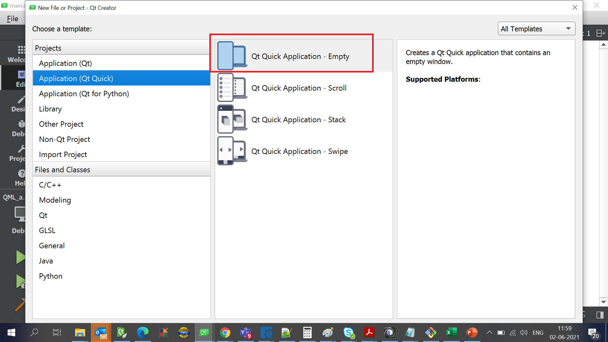

# Tutorial for creating QT Quick Application.

This Tutorial we will see how to create a QML project.

# Create new project on QT 5.15.2

## Step-1

## Step-2

## Step-3

## Step-4

## Step-5

## Step-6

## Step-7

## Step-8

## Step-9
