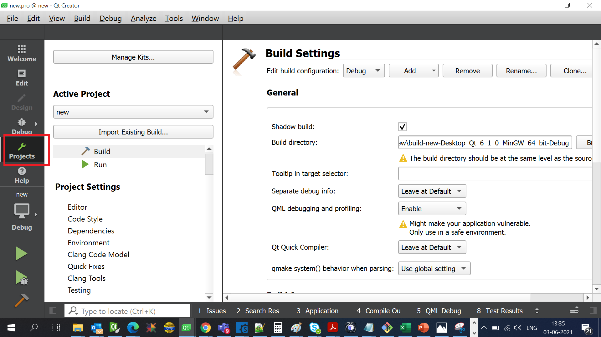
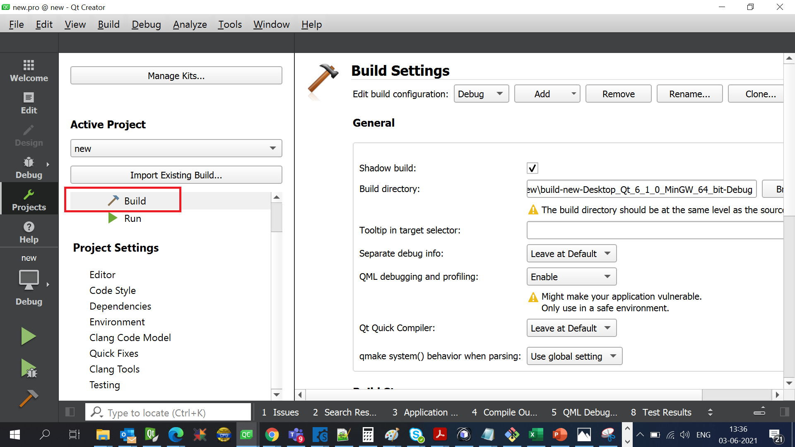
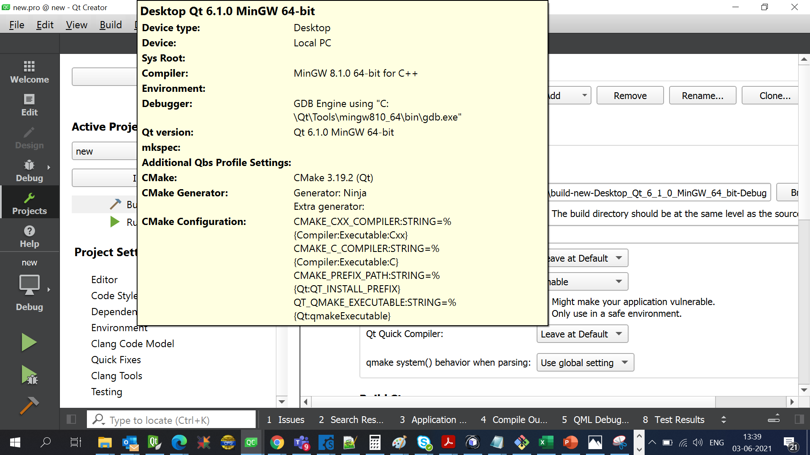

# faq

## Which version of QT to use ?
Sample applications are tested for QT IO version : QT 5.15.2.

## How to Add QML based widgets to my QT application code ? 
Just include the respective QML file for widget & refer to sample application code provided.

## What precautions to take care while using QML language ? 
[Naming Custom QML Object Types](https://doc.qt.io/qt-5/qtqml-documents-definetypes.html#naming-custom-qml-object-types)
QML imposes some limitations on how you can name things, QML documents or exposed C++ enums keys must begin with capital letters, and properties or ids must not begin with a capital letter. 

## How to configure QT kit ? 
[Configure QT kit](https://www.youtube.com/watch?v=dM7EegKqxAQ)   
[Qt Creator Kit Setup](https://www.youtube.com/watch?v=eZ-HOc2P_EI)

## Which C++ (c++11, C++14)version I can use in my QT Application ?
[Which C++ version I can use.](https://stackoverflow.com/questions/26127217/how-can-i-use-c14-features-when-building-qmake-projects) 
Qt Creator is just an IDE.
You can think of IDEs as "smarter text editors" that aid the developer with debugging, building, code completion, file management and so on.
IDEs are irrelevant during compilation. What matters is your compiler. And it is independent from your IDE.

## How to check which compiler QT uses, for my application ?
We can check directly, by following steps.

### Step-1 : GO to Projects section.  

### Step-2 : Hover your mouse cursor over Build button.

### Step-3 : Compiler version used pop up.

