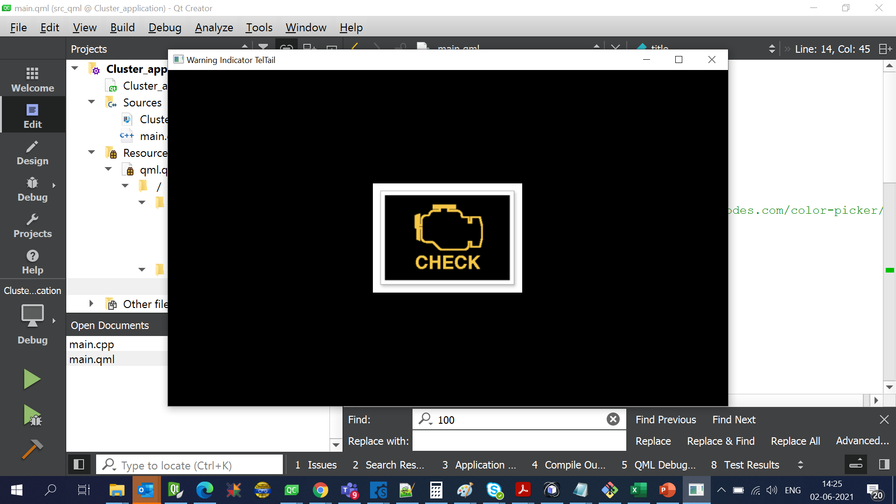

# Tutorial for Setting up the Warning Indicator in QML based application.

Here will will discuss how we can Setting up the Warning Indicator in QML based application. 

# Sample code 
```
import QtQuick 2.12
import QtQuick.Window 2.12

Window {
    width: 800
    height: 480
    visible: true
    color: "black"
    title: qsTr("Warning Indicator TelTail")

    Image
    {
        id: telTailBaseID
        source: "/images/Teltail_base.png"
        anchors.centerIn: parent
    }

    Image
    {
        id: cheakEngineID
        source: "/images/Check-Engine-Light_1.png"
        anchors.centerIn: parent
    }

    Timer{
        id:tellTailUpdate
        interval: 1000  // 1000 msec
        running: true
        repeat: true
        property real  teltail_toggel: 0

        onTriggered: {

            switch (teltail_toggel)
            {
            case 0 :
                cheakEngineID.visible = true;
                teltail_toggel++;
                break;
            case 1 :
                cheakEngineID.visible = false;
                teltail_toggel = 0;
                break;
            }
        }
    }
}

```
# Warning Indicator : Sample Project
[Warning Indicator Sample Project](https://doc.qt.io/qt-5/qtquick-index.html) 

# Warning Indicator : Sample Project : QAClib
[Warning Indicator Sample Project](https://doc.qt.io/qt-5/qtquick-index.html) 

# Warning Indicator : Sample Project : X,Y cordinate setting for images : QAClib
[Warning Indicator Sample Project](https://doc.qt.io/qt-5/qtquick-index.html) 

# Warning Indicator GUI Image


# Warning Indicator GUI Video
[Warning Indicator Demo video on Youtube](https://doc.qt.io/qt-5/qtquick-index.html) 